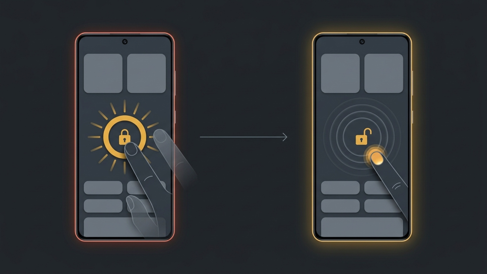
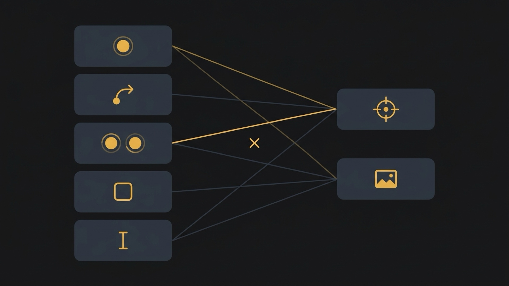

# Auto Click

<p align="center">
  <a href="README.md">English</a> | <a href="README.vi.md">Tiếng Việt</a> | <a href="README.zh-Hans.md">简体中文</a> | <a href="README.ja.md">日本語</a> | <b>Español</b>
</p>

<p align="center">
  
</p>

<p align="center">
  <a href="https://github.com/phanbaohuy96/auto-click/actions"></a>
  <a href="macos/"></a>
  <a href="android/"></a>
  <a href="docs/sdd/08-permissions-and-safety.md"></a>
  <a href="docs/sdd/09-localisation.md"></a>
</p>

Automatice el trabajo repetitivo emitiendo pulsaciones y clics sintéticos de alta precisión: una secuencia ordenada de operaciones donde cada **Paso (Step)** combina una **Acción (Action)** con un **Objetivo (Target)**, grabados o configurados a mano y reproducidos bajo demanda.

**Un producto, dos plataformas.** Los conceptos son comunes; la implementación es totalmente nativa en cada sistema operativo.

| Plataforma | Interfaz y estado | Descripción |
|---|---|---|
| [**`macos/`**](macos/README.md) | **App de barra de menús** (macOS 14+) · *Publicada* | Desarrollada en Swift / SwiftUI, impulsada por ScreenCaptureKit y Apple Vision. Verificada a mano en hardware real — [una suite e2e manual registrada resultado por resultado](docs/manual-e2e-tests.md). |
| [**`android/`**](android/README.md) | **Panel flotante superpuesto** (Android 11+) · *Completada* | Desarrollada en Jetpack Compose sobre el Servicio de Accesibilidad de Android. Probada en emulador — **aún no en hardware físico** ([pruebas](android/docs/testing.md)). |

---

## ¿Por qué Auto Click?

La gran mayoría de los auto-clickers del mercado son **juguetes plagados de fallos** (con más de 100 millones de descargas pero con un fallo fatal de bloqueo táctil que obliga a reiniciar el teléfono) o **herramientas demasiado complejas** (que exigen aprender lenguajes de scripting solo para pulsar un botón). Auto Click se posiciona exactamente en el equilibrio ideal. Toda la evidencia y el análisis comparativo están detallados en [`android/docs/landscape.md`](android/docs/landscape.md).

```
                      ┌──────────────────────────────────────────────┐
                      │                 Auto Click                   │
                      │   Interfaz limpia · Reconocimiento visual    │
                      │     Sin bloqueos · Basado en especificación  │
                      └──────────────────────┬───────────────────────┘
                                             │
               ┌─────────────────────────────┴─────────────────────────────┐
               ▼                                                           ▼
┌──────────────────────────────┐                           ┌──────────────────────────────┐
│  Clickers simples (100M+ DL) │                           │  Herramientas de Scripting   │
│  Bloqueo táctil (pide reboot)│                           │  Curva de aprendizaje empinada│
│  Sin reconocimiento visual   │                           │  Código y tokens complejos   │
│  Suscripciones semanales caras│                          │  Alto consumo de batería     │
└──────────────────────────────┘                           └──────────────────────────────┘
```

### 1. 🛡️ Seguridad táctil sin congelamientos (`SF-1` y "Liberar el toque")

El peor fallo de esta categoría es el **bloqueo por pulsación atascada (stuck-touch freeze)**: si el usuario toca la pantalla en el milisegundo exacto en que se emite una pulsación sintética, el sistema bloquea el último contacto y el teléfono deja de responder al dedo por completo hasta reiniciarlo. [Los informes de XDA confirman que es reproducible en *todas* las apps populares probadas](android/docs/landscape.md).

- **Norma `SF-1`** — El motor de ejecución libera incondicionalmente cualquier botón presionado y cualquier trazo táctil ante **cualquier** salida: finalización, parada, cancelación o error ([especificación de seguridad](docs/sdd/08-permissions-and-safety.md)).
- En Android, la acción **Liberar el toque (Free the touch)** es una recuperación de un solo toque disponible tanto en la notificación permanente como en los Ajustes Rápidos, desbloqueando la pantalla sin necesidad de reiniciar el dispositivo.

<p align="center">
  
</p>
<p align="center"><em>Izquierda: el toque enganchado que arrastra toda la categoría. Derecha: liberado — <code>SF-1</code> suelta en cualquier salida, y Liberar el toque rescata uno que ya está atascado.</em></p>

### 2. 👁️ Encontrar el objetivo en lugar de confiar en coordenadas ciegas

Un punto fijo falla en el instante en que una ventana se mueve, un anuncio cambia de tamaño o la interfaz se adapta.

- **Detección por plantilla (Template matching)** — Recorte un elemento directamente de la pantalla y apunte un **Paso** hacia él. En macOS reconoce a dos escalas para que una **Plantilla** funcione indistintamente en la pantalla Retina o en un monitor externo ([ADR-0008](docs/adr/0008-match-templates-at-two-scales.md)). En Android funciona a escala única vinculada al perfil de la pantalla ([ADR-0013](android/docs/adr/0013-coordinates-are-raw-pixels-bound-to-a-screen-profile.md)).
- **Reconocimiento de texto (OCR)** — En macOS busca palabras (*"Guardar"*, *"Reclamar"*, *"Enviar"*) mediante Apple Vision. **Aún no implementado en Android** por depender de ML Kit y no distribuirse en Play Store ([10-recognition.md](android/docs/sdd/10-recognition.md)).
- **Manejo explícito de tiempo de espera (`DM-16`)** — Cada búsqueda tiene un tiempo límite configurable y permite decidir qué hacer si no se encuentra: omitir ese **Paso** o detener el **Escenario (Scenario)**. Nunca se queda colgado en silencio.

<p align="center">
  
  &nbsp;
  
</p>
<p align="center"><em>Android en emulador: recorte del objetivo y configuración del Paso generado.</em></p>

### 3. 🧩 Modelo Ortogonal Acción × Objetivo

Un **Paso** asocia exactamente una **Acción** con un **Objetivo** ([ADR-0002](docs/adr/0002-step-is-action-times-target.md)):

- **Acciones** — macOS: clic (simple, doble, triple, mantener presionado), desplazamiento (scroll), mover cursor, arrastrar, escribir texto, atajos de teclado. Android: toque (tap), deslizar (swipe), toque múltiple, acción global del sistema, establecer texto.
- **Objetivos** — macOS: posición del cursor, punto absoluto, desplazamiento relativo a la esquina más cercana de la ventana, **Plantilla** de imagen, texto OCR. Android: punto fijo, opcionalmente desplazado por búsqueda de **Plantilla**.
- **Sin bifurcaciones confusas** — Cada **Paso** decide únicamente su propio destino al agotarse el tiempo de espera y nunca altera el flujo de otros pasos ([ADR-0011](docs/adr/0011-a-scenario-has-no-branches.md)). Sin laberintos de `if`/`else`.

<p align="center">
  
</p>
<p align="center"><em>La Acción a la izquierda, el Objetivo a la derecha — un Paso es uno de cada, elegidos de forma independiente.</em></p>

### 4. 📱 Panel Superpuesto en Android (Overlay)

- Control flotante móvil que se aparta fácilmente para no entorpecer la aplicación a automatizar.
- **Marcadores (Markers)** numerados que se arrastran directamente a las posiciones deseadas.
- Deslizamientos con duración personalizada y gestos multitáctiles configurables.
- 5 idiomas de interfaz que cambian **en tiempo real**, sincronizando la pantalla principal y el panel flotante sin necesidad de reiniciar la app ([11-localisation.md](android/docs/sdd/11-localisation.md)).

<p align="center">
  
</p>
<p align="center"><em>Un solo ajuste actualiza ambas interfaces al instante, sin reinicio.</em></p>

### 5. 🎥 Grabación fiel de acciones reales

- **macOS** — Presione `⌥⌘R` para iniciar y detener la grabación. Preserva los ritmos y tiempos reales en lugar de aplanarlos a intervalos constantes ([ADR-0004](docs/adr/0004-recordings-keep-real-timing.md)). Infiere automáticamente coordenadas relativas a la ventana si la sesión se mantiene dentro de una aplicación.
- **Android** — La capa de grabación captura cada pulsación, la registra y la transmite a la app subyacente, permitiéndole grabar mientras utiliza la app con total normalidad ([08-recording.md](android/docs/sdd/08-recording.md)).
- **Únicamente ratón y toques táctiles, nunca teclado.** Una decisión deliberada de seguridad: registrar el teclado convertiría a la app en un keylogger peligroso ([ADR-0003](docs/adr/0003-no-keyboard-capture-when-recording.md)).

---

## Comparativa con la Competencia

Datos extraídos del análisis de mercado en [`android/docs/landscape.md`](android/docs/landscape.md):

| Criterio | Auto-clickers tradicionales *(True Developers, etc.)* | Macrorify | Klick'r / Smart AutoClicker | **Auto Click (Este Proyecto)** |
|---|---|---|---|---|
| **Recuperación de bloqueo táctil** | ❌ Defecto generalizado; exige reiniciar | ⚠️ Parcial | ⚠️ No abordado específicamente | ✅ **`SF-1` + Botón "Liberar el toque"** |
| **Detección visual** | ❌ Inexistente | ✅ Plantilla + OCR | ✅ Disparadores por imagen | ✅ **Plantilla en ambos sistemas; OCR en macOS** |
| **Facilidad de uso** | Sencillo (muy limitado) | Muy difícil (lógica compleja o código) | Difícil (falta de documentación clara) | **Fácil a Medio, intuitivo y visual** |
| **Multiplataforma** | ❌ Solo Android | ❌ Solo Android | ❌ Solo Android | ✅ **macOS y Android nativos** |
| **Basado en especificaciones** | — | — | — | ✅ **Cada comportamiento tiene un requisito numerado en código** |

---

## Capacidades por Plataforma

| Capacidad | macOS (`macos/`) | Android (`android/`) |
|---|:---:|:---:|
| **Entorno de ejecución** | Barra de menús + ScreenCaptureKit | Servicio en primer plano + Panel flotante de Accesibilidad |
| **Acciones disponibles** | Clic, scroll, mover, arrastrar, escribir, atajos | Toque, deslizar, multitáctil, acciones globales, texto |
| **Objetivo: cursor / punto fijo** | ✅ Ambos | ✅ Punto fijo mediante **Marcadores** |
| **Objetivo: relativo a ventana** | ✅ Seguimiento de esquina más cercana | N/A — No aplicable a dispositivos móviles |
| **Objetivo: plantilla de imagen** | ✅ Emparejador piramidal a dos escalas | ✅ Escala fija ([ADR-0013](android/docs/adr/0013-coordinates-are-raw-pixels-bound-to-a-screen-profile.md)) |
| **Objetivo: texto OCR** | ✅ Apple Vision | ❌ No implementado (dependencia de ML Kit) |
| **Grabación de acciones** | ✅ Eventos de ratón con cadencia real | ✅ Paso táctil fluido (multitáctil no grabado) |
| **Idiomas de interfaz** | ✅ 5 idiomas, cambio inmediato | ✅ 5 idiomas, cambio sincronizado en vivo |
| **Verificado en hardware real** | ✅ [suite e2e manual](docs/manual-e2e-tests.md) | ❌ Solo emulador ([pruebas](android/docs/testing.md)) |

---

## Hoja de Ruta y Comercialización

**Funcionalidades en fase de planificación.** Se registran aquí para definir el rumbo del proyecto; aún no están presentes en el repositorio:

- **Las funciones esenciales son y serán 100% gratuitas.** Clics ilimitados, gestos con múltiples puntos, grabación y seguridad `SF-1`.
- **Pago único asequible en lugar de suscripciones periódicas.** Eliminamos las suscripciones semanales abusivas que los usuarios rechazan.
- **Funcionalidades Pro candidatas**: Modo anti-detección (fluctuación de coordenadas Gaussiana y variación de intervalos), trazos de deslizamiento naturales basados en curvas Bézier, programador con reloj absoluto (ofertas flash y recompensas diarias), detector de color por píxel (Color Guard) y guardado ilimitado de escenarios.

---

## Guía Rápida de Instalación

### macOS (macOS 14 Sonoma o posterior)

Requiere Xcode Command Line Tools.

```bash
git clone https://github.com/phanbaohuy96/auto-click.git
cd auto-click/macos

swift test              # Ejecutar pruebas unitarias y de especificación
./scripts/install.sh    # Compilar e instalar en /Applications
```

> **Primer uso**: Conceda permiso de **Accesibilidad** en `Ajustes del Sistema → Privacidad y seguridad → Accesibilidad`, y **Grabación de pantalla** si utiliza detección de plantillas u OCR.
> **Parada de emergencia**: Presione **`⌥⌘S`** en cualquier momento para detener inmediatamente cualquier automatización y soltar botones o pulsaciones.

### Android (Android 11 o posterior)

```bash
cd auto-click/android

./gradlew assembleDebug        # Generar APK de depuración
./gradlew testDebugUnitTest    # Ejecutar pruebas unitarias
```

> **Primer uso**: La pantalla de bienvenida le guiará para otorgar permisos de superposición sobre otras aplicaciones y el Servicio de Accesibilidad. En Android 13+, los ajustes restringidos requieren activación manual en la información de la aplicación — consulte [`02-permissions-and-onboarding.md`](android/docs/sdd/02-permissions-and-onboarding.md).

---

## Documentación y Especificaciones

En ambas plataformas, el diseño de la especificación **precede a la escritura del código**. Todo comportamiento observable corresponde a un requisito numerado en los documentos `sdd/`, citado en el código fuente.

| Documento | Respuestas |
|---|---|
| [`CONTEXT-MAP.md`](CONTEXT-MAP.md) | Correspondencia de glosarios entre plataformas |
| [`CONTEXT.md`](CONTEXT.md) | Lenguaje de dominio compartido — definición de conceptos clave |
| [`docs/adr/`](docs/adr/) | Registro de decisiones de arquitectura — `0001`–`0011` comunes/macOS, `0012`+ Android |
| [`docs/sdd/`](docs/sdd/) | Documento de diseño de sistema y especificación de macOS |
| [`android/docs/`](android/docs/) | Glosario, especificaciones, decisiones, estudio de mercado y plan de pruebas de Android |
| [`docs/manual-e2e-tests.md`](docs/manual-e2e-tests.md) | Pruebas realizadas en hardware real y resultados obtenidos |

---

## Idiomas Disponibles

Disponible en 5 idiomas sin necesidad de reiniciar la aplicación:

🇬🇧 **English** · 🇻🇳 **Tiếng Việt** · 🇨🇳 **中文（简体）** · 🇯🇵 **日本語** · 🇪🇸 **Español**

---

## Licencia

Este proyecto está bajo la Licencia [MIT](LICENSE).
