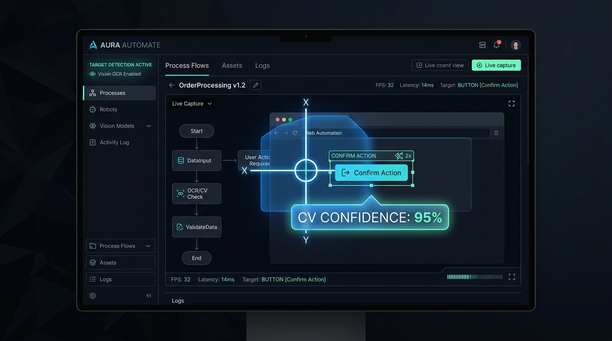
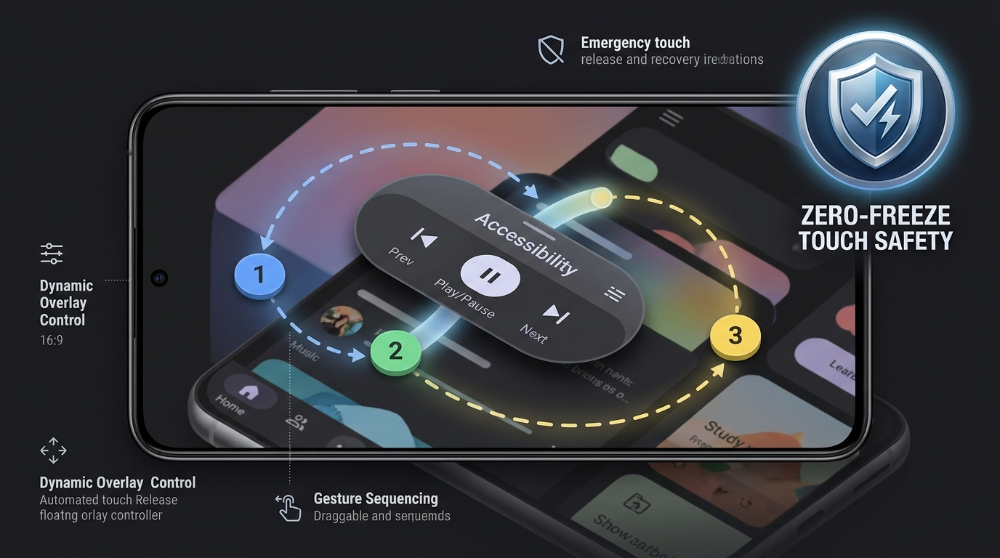

# Auto Click

<p align="center">
  
</p>

<p align="center">
  <a href="https://github.com/phanbaohuy96/auto-click/actions"></a>
  <a href="macos/"></a>
  <a href="android/"></a>
  <a href="docs/sdd/08-permissions-and-safety.md"></a>
  <a href="docs/sdd/09-localisation.md"></a>
</p>

Automate repetitive work by emitting high-precision synthetic input: an ordered sequence of operations, each one an **Action** paired with a **Target**, recorded or built by hand and replayed on demand.

**One product, two platforms.** The concepts are shared; the execution is native to each platform.

| Platform | Interface & Status | Description |
|---|---|---|
| [**`macos/`**](macos/README.md) | **Native Menu-Bar App** (macOS 14+) · *Shipping* | Swift / SwiftUI menu-bar app powered by ScreenCaptureKit and Apple Vision OCR. |
| [**`android/`**](android/README.md) | **Floating Overlay Service** (Android 11+) · *Active Development* | Jetpack Compose floating overlay utilizing Accessibility Service gesture dispatch. |

---

## Why Auto Click?

Most auto-clickers in the wild are either **dumb-but-buggy toys** (100M+ downloads with fatal touch-freeze bugs) or **steep, fragile power tools** (bloated scripting engines with predatory subscriptions). Auto Click bridges that gap with reliability, safety, and visual intelligence.

```
                      ┌──────────────────────────────────────────────┐
                      │                 Auto Click                   │
                      │   Clean UI · Vision & OCR · Crash-Proof      │
                      │      Zero-Freeze Safety · Fair Pricing       │
                      └──────────────────────┬───────────────────────┘
                                             │
               ┌─────────────────────────────┴─────────────────────────────┐
               ▼                                                           ▼
┌──────────────────────────────┐                           ┌──────────────────────────────┐
│  Dumb Clickers (100M+ DLs)   │                           │     Scripting Power Tools    │
│  Stuck-touch freeze bugs     │                           │     Steep learning curve     │
│  No image/text recognition   │                           │     Complex code / tokens    │
│  Predatory weekly paywalls   │                           │     Heavy battery drain      │
└──────────────────────────────┘                           └──────────────────────────────┘
```

### 1. 🛡️ Zero-Freeze Touch Safety (`SF-1` & "Free the Touch")
The #1 complaint across 100M+ auto-clicker installs is the infamous **stuck-touch freeze**: touching the screen during synthetic input latches the touch and freezes the device until rebooted.
- Auto Click enforces **`SF-1`**: **every held button or touch stroke is unconditionally released on exit** (completion, stop, cancellation, or error).
- On Android, a dedicated **"Free the touch"** emergency recovery action in the persistent notification and Quick Settings tile unlatches any stuck stroke in one tap without rebooting.

### 2. 👁️ Computer Vision & Text OCR Target Recognition
Never rely on fragile pixel coordinates that fail whenever a window moves, a banner shifts, or screen resolution changes.
- **Template Matching**: Drag and crop any image directly from the screen (or from a screenshot). Features multi-scale pyramid matching that survives switching between built-in Retina and external monitors ([ADR-0008](docs/adr/0008-match-templates-at-two-scales.md)).
- **Vision OCR**: Aim at text buttons (*"Save"*, *"Claim"*, *"Submit"*) using Apple Vision OCR or Google ML Kit.
- **Visible Fallback (`DM-16`)**: Define exact timeouts and choose whether to `skipStep` or `stopScenario` if a target is not found.

<p align="center">
  
</p>

### 3. 🧩 Orthogonal Action × Target Model
A **Step** pairs exactly one **Action** with exactly one **Target**:
- **Actions**: Click / Tap (single, double, triple, hold), Scroll, Move, Drag / Swipe, Type text (key-by-key ASCII emulation), Global actions.
- **Targets**: At the cursor, Absolute screen point, Window-relative offset (anchored to nearest corner), Image template, OCR text bounding center.
- **Branchless Scenarios**: No confusing `if/else` spaghetti. A step decides its own fate (`skipStep` on timeout) and never another step's ([ADR-0011](docs/adr/0011-a-scenario-has-no-branches.md)).

### 4. 📱 Android Floating Overlay & Gestures
- Movable floating control pill that stays out of your way while configuring apps.
- Numbered circular **Markers** dragged directly onto your target points.
- Multi-finger gestures, duration-controlled swipes, and natural easing.

<p align="center">
  
</p>

### 5. 🎥 Faithful Mouse Recording
Press `⌥⌘R` on macOS to record real-world workflows:
- Preserves natural user timing and gesture cadences ([ADR-0004](docs/adr/0004-recordings-keep-real-timing.md)).
- Automatically infers window-relative coordinates when a session stays inside one app.
- **Privacy-first**: Deliberately captures mouse events only—no keyboard interception to prevent keylogging risks ([ADR-0003](docs/adr/0003-no-keyboard-capture-when-recording.md)).

---

## Market Comparison

| Feature / Criteria | Traditional Auto-Clickers *(True Devs, etc.)* | Macrorify | Desktop Macro Tools *(MurGaa, KM)* | **Auto Click (This Project)** |
|---|---|---|---|---|
| **Touch-Freeze Recovery** | ❌ Fatal bug (Requires phone reboot) | ⚠️ Partial | N/A (Desktop only) | ✅ **Built-in `SF-1` + One-tap recovery** |
| **Image & OCR Detection** | ❌ None | ✅ Complex visual scripts | ⚠️ Limited / Paid add-ons | ✅ **Dual-scale Vision & Template matching** |
| **Learning Curve** | Low (Very basic) | High (Requires coding/logic) | High (Complex desktop rules) | **Low–Medium (Visual, intuitive)** |
| **Cross-Platform** | ❌ Android only | ❌ Android only | ❌ macOS/Windows only | ✅ **macOS & Android native** |
| **Commercial Model** | ❌ Predatory subscriptions ($1.99/wk) | ⚠️ Credit/Reputation limits | ❌ Expensive ($10–$36/machine) | ✅ **100% Free Core + Affordable Lifetime Pro** |

---

## Platform Capabilities Matrix

| Capability | macOS (`macos/`) | Android (`android/`) |
|---|:---:|:---:|
| **Runtime Architecture** | Menu-bar popover + ScreenCaptureKit | Foreground service + AccessibilityService Overlay |
| **Core Actions** | Click, Scroll, Move, Drag, Type, Key shortcut | Tap, Swipe, Multi-touch, Global Actions, SetText |
| **Target: Cursor / Fixed Point** | ✅ | ✅ (Fixed point / Markers) |
| **Target: Window-relative offset** | ✅ (Nearest corner tracking) | N/A (Mobile full-screen / split) |
| **Target: Template Image Matching** | ✅ (Two-scale pyramid matcher) | 🚧 Specified (Slice A3) |
| **Target: Vision OCR Text** | ✅ (Apple Vision framework) | 🚧 Planned (Slice A3) |
| **Recording Workflows** | ✅ Live mouse event capture | 🚧 Specified (Slice A2 - Pass-through) |
| **Multi-Language Support** | ✅ 5 languages (`en`, `vi`, `zh`, `ja`, `es`) | 🚧 Planned (Slice A4) |
| **Commercialization Readiness** | ✅ In-App purchase & Ed25519 License key | ✅ Google Play Billing & AdMob support |

---

## Commercialization & Licensing Philosophy

Auto Click follows a **"Volume-over-margin" (Lấy số lượng bù vào giá)** strategy:
- **100% Free Core Functionality**: Unlimited basic clicking, multi-target gestures, mouse recording, and complete touch safety (`SF-1`) are free forever with polite, non-intrusive ads.
- **Micro-Priced Lifetime Pro Upgrade**:
  - **Android**: $0.99 (~25,000 VND) to remove ads permanently; $1.99 (~49,000 VND) for Lifetime Pro (Anti-detection jitter, Bézier curves, Wall-clock scheduler, Color guard, Unlimited scenario slots).
  - **macOS**: $2.99 – $4.99 one-time lifetime license (significantly lower than MurGaa $10 or Keyboard Maestro $36).
  - **No recurring weekly/monthly subscription traps.**

---

## Quick Start

### macOS (macOS 14 Sonoma or Sequoia)

Requires Xcode Command Line Tools.

```bash
# Clone the repository
git clone https://github.com/phanbaohuy96/auto-click.git
cd auto-click/macos

# Run unit and specification test suites
swift test

# Build and install Auto Click into /Applications
./scripts/install.sh
```

> **First Run**: Grant **Accessibility** permission in `System Settings → Privacy & Security → Accessibility`. Grant **Screen Recording** when utilizing Template Matching or Text OCR.
> **Emergency Stop**: Press **`⌥⌘S`** at any time to immediately halt all automation and release buttons.

### Android (Android 11+)

```bash
cd auto-click/android

# Build debug APK
./gradlew assembleDebug

# Run unit tests
./gradlew testDebugUnitTest
```

---

## Documentation & Specifications

The specification comes **before** the code on both platforms. Every observable behaviour appears in an `sdd/` document as a numbered requirement cited in the source code.

| Document | Answers |
|---|---|
| [`CONTEXT-MAP.md`](CONTEXT-MAP.md) | Which glossary covers which platform |
| [`CONTEXT.md`](CONTEXT.md) | Shared ubiquitous domain language across platforms |
| [`docs/adr/`](docs/adr/) | Architectural Decision Records (`0001`–`0011` shared/macOS, `0012`+ Android) |
| [`docs/sdd/`](docs/sdd/) | System Design Documents and requirements for the product and macOS |
| [`android/docs/`](android/docs/) | Android glossary, specifications, decisions, market survey, and test plan |
| [`docs/manual-e2e-tests.md`](docs/manual-e2e-tests.md) | End-to-end hardware manual test suites and verification results |

### Paths
Commands in [`macos/README.md`](macos/README.md) run from `macos/`. Paths named inside `docs/sdd/` and `docs/adr/` (`Sources/`, `Resources/`, `Package.swift`, `scripts/`) are relative to `macos/` as well; they were written when that was the repository root.

---

## Internationalization

Auto Click speaks 5 interface languages out of the box with instant live switching (no relaunch required):
- 🇬🇧 **English** (Default)
- 🇻🇳 **Tiếng Việt**
- 🇨🇳 **中文（简体）**
- 🇯🇵 **日本語**
- 🇪🇸 **Español**

---

## License

This project is licensed under the MIT License - see the [LICENSE](LICENSE) file for details.
