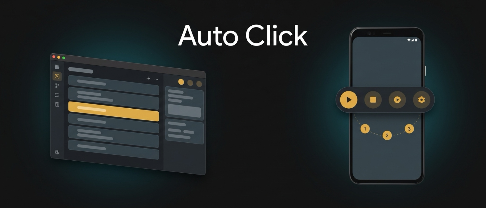
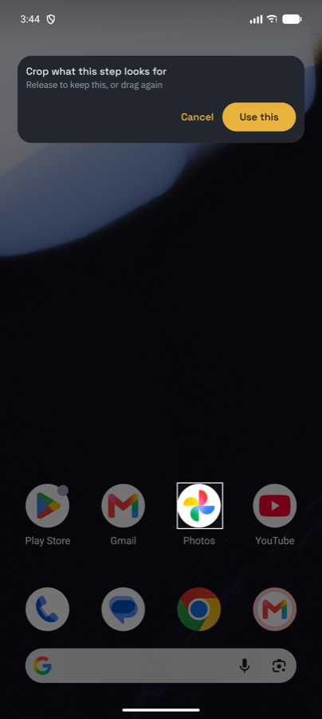
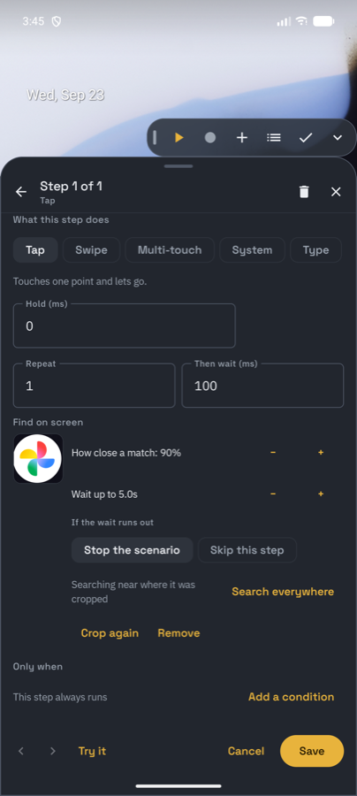
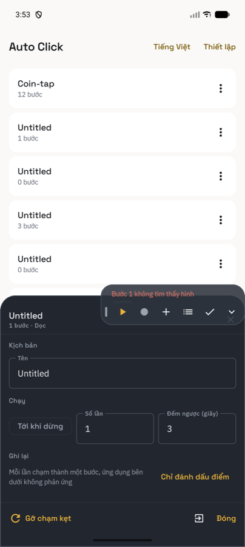

# Auto Click

<p align="center">
  <a href="README.md">English</a> | <a href="README.vi.md">Tiếng Việt</a> | <b>简体中文</b> | <a href="README.ja.md">日本語</a> | <a href="README.es.md">Español</a>
</p>

<p align="center">
  
</p>

<p align="center">
  <a href="https://github.com/phanbaohuy96/auto-click/actions"></a>
  <a href="macos/"></a>
  <a href="android/"></a>
  <a href="docs/sdd/08-permissions-and-safety.md"></a>
  <a href="docs/sdd/09-localisation.md"></a>
</p>

通过发送合成输入自动化重复性工作：一个有序的操作序列，每个操作都是一个**动作（Action）**与一个**目标（Target）**的组合，既可手动录制亦可手工构建，并按需回放。

**一个产品，两个平台。** 核心概念通用共享，底层实现完全原生。

| 平台 | 界面与状态 | 概述 |
|---|---|---|
| [**`macos/`**](macos/README.md) | **菜单栏应用**（macOS 14+）· *已发布* | Swift / SwiftUI 开发，由 ScreenCaptureKit 与 Apple Vision 驱动。在真实硬件上手工验证 — [73 项端到端测试结果](docs/manual-e2e-tests.md)。 |
| [**`android/`**](android/README.md) | **悬浮窗服务**（Android 11+）· *四个切片已全部完成* | 基于 AccessibilityService 的 Jetpack Compose 悬浮窗应用。目前仅在模拟器上运行 — **尚未在实体设备上验证**（[测试记录](android/docs/testing.md)）。 |

---

## 为什么选择 Auto Click？

市场上现有的绝大多数自动点击器要么是**漏洞百出的玩具**（拥有上亿下载量，却伴随着导致手机死锁、必须重启手机的触控卡死严重缺陷），要么是**极其复杂的重型工具**（点击一个按钮却需要编写复杂脚本）。Auto Click 正好填补了这两者之间的空白。相关分析与证据请参阅市场调研报告 [`android/docs/landscape.md`](android/docs/landscape.md)。

```
                      ┌──────────────────────────────────────────────┐
                      │                 Auto Click                   │
                      │   清爽界面 · 图像匹配 · 零崩溃稳定架构       │
                      │      绝不死锁 · 规范驱动的标准实现           │
                      └──────────────────────┬───────────────────────┘
                                             │
               ┌─────────────────────────────┴─────────────────────────────┐
               ▼                                                           ▼
┌──────────────────────────────┐                           ┌──────────────────────────────┐
│  简易点击器（1亿+ 下载量）   │                           │     脚本重型工具             │
│  触控卡死严重缺陷（需重启） │                           │     极高的学习门槛           │
│  无图像/文本识别支持         │                           │     代码晦涩、机制繁杂       │
│  每周昂贵的扣费订阅          │                           │     严重发热、耗电飞快       │
└──────────────────────────────┘                           └──────────────────────────────┘
```

### 1. 🛡️ 绝不死锁的触控安全（`SF-1` 与「释放触控」）

该品类中最严重的缺陷是**触控卡死（stuck-touch freeze）**：当合成输入触发的瞬间若用户手指正好接触屏幕，底层输入服务会锁定最后的触摸状态，导致屏幕完全不再响应任何物理操作，唯有重启手机方能解决。[XDA 论坛报告指出该问题在测试的所有同类热门应用中均可复现](android/docs/landscape.md)。

- **`SF-1` 规范** — 在**任何**退出路径（执行完成、手动停止、取消或异常中断）下，运行器都必须强制释放每一个被按下的鼠标按键与每一个触摸笔画（[安全设计文档](docs/sdd/08-permissions-and-safety.md)）。
- 在 Android 上，常驻通知栏与快捷设置图块（Quick Settings tile）均提供一键**释放触控（Free the touch）**功能，无需重启即可立即解脱卡死的触摸笔画。

### 2. 👁️ 智能目标识别，告别脆弱的固定坐标

一旦窗口移动、横幅浮动或界面布局自适应调整，写死的坐标就会失效。

- **模板匹配（Template matching）** — 直接从屏幕截取一块图像，并将**步骤（Step）**对准该目标。在 macOS 上支持两级缩放匹配，即使在 Retina 视网膜屏与外接普通显示器之间切换，**模板**依然能被准确识别（[ADR-0008](docs/adr/0008-match-templates-at-two-scales.md)）。Android 上采用固定单尺度匹配，因为方案与当前屏幕严格绑定（[ADR-0013](android/docs/adr/0013-coordinates-are-raw-pixels-bound-to-a-screen-profile.md)）。
- **文本识别（OCR）** — macOS 通过 Apple Vision 定位文字（如 *"保存"*、*"领取"*、*"提交"*）。**Android 暂未包含**，具体原因见 [`10-recognition.md`](android/docs/sdd/10-recognition.md)（需要引入 ML Kit 且本应用未通过 Play 商店分发）。
- **透明的超时回退机制（`DM-16`）** — 每次查找均允许设定超时时间，并可自由选择超时后的处理方式：跳过该**步骤**，或终止整个**脚本（Scenario）**。绝不出现无声假死。

<p align="center">
  
  &nbsp;
  
</p>
<p align="center"><em>Android 模拟器演示：裁剪步骤所需的目标，并生成对应配置步骤。</em></p>

### 3. 🧩 正交的「动作 × 目标」模型

一个**步骤（Step）**精确绑定一个**动作（Action）**与一个**目标（Target）**（[ADR-0002](docs/adr/0002-step-is-action-times-target.md)）：

- **动作（Actions）** — macOS：单击（单/双/三击、长按）、滚动、移动光标、拖拽、输入字符串、快捷键。Android：点击、滑动、多指触控、系统全局动作、输入文本。
- **目标（Targets）** — macOS：当前光标处、绝对坐标、相对于窗口最近边角的位置、图像**模板**、OCR 文字。Android：指定坐标点，可选附带**模板**搜索校准。
- **无分支设计** — 每个**步骤**仅在超时时决定自身的命运，绝不能影响或跳过其他步骤（[ADR-0011](docs/adr/0011-a-scenario-has-no-branches.md)）。没有复杂的 `if`/`else` 分支干扰，杜绝逻辑混乱。

### 4. 📱 Android 悬浮窗交互

- 可自由拖拽移动的悬浮控制面板，绝不遮挡正在被自动化的应用界面。
- 带数字编号的**标记（Marker）**，直接拖放到目标应用的上层指定位置。
- 支持自定义时长的顺滑滑动操作，以及手动编排的多点触控手势。
- 5 种界面语言**即时无缝切换**，Activity 与悬浮窗同时生效，无需重启应用（[11-localisation.md](android/docs/sdd/11-localisation.md)）。

<p align="center">
  
</p>
<p align="center"><em>一处设置，双面即变，无需重启。</em></p>

### 5. 🎥 忠实重放真实操作记录

- **macOS** — 按下 `⌥⌘R` 启动和结束录制，完整保留真实的人手操作节奏，而非压缩为死板的固定间隔（[ADR-0004](docs/adr/0004-recordings-keep-real-timing.md)）。若录制全过程都在同一程序内，会自动将其转换为相对窗口的相对坐标。
- **Android** — 录制层捕获每次触摸操作，予以记录的同时无缝穿透分发给下层应用，边正常使用即可边完成录制（[08-recording.md](android/docs/sdd/08-recording.md)）。
- **仅捕获鼠标与触控，绝不捕获键盘输入。** 这是出于隐私安全的审慎设计：监听系统键盘输入的工具实际上等同于键盘记录器（keylogger）（[ADR-0003](docs/adr/0003-no-keyboard-capture-when-recording.md)）。

---

## 市场同类产品横向对比

根据 [`android/docs/landscape.md`](android/docs/landscape.md) 的实测调研整理：

| 评估维度 | 传统点击器 *(True Developers 等)* | Macrorify | Klick'r / Smart AutoClicker | **Auto Click（本项目）** |
|---|---|---|---|---|
| **触控卡死解脱机制** | ❌ 全行业痛点，仅能强行重启设备 | ⚠️ 部分缓解 | ⚠️ 未作针对性处理 | ✅ **`SF-1` 强制释放 + 一键「释放触控」** |
| **图像识别能力** | ❌ 完全无 | ✅ 模板匹配 + OCR | ✅ 图像触发器 | ✅ **双平台均支持模板；macOS 支持 OCR** |
| **学习门槛** | 极低（功能单一） | 极高（需学习逻辑与脚本） | 较高（文档匮乏被广为诟病） | **低至中等，纯视觉化交互** |
| **多平台覆盖** | ❌ 仅 Android | ❌ 仅 Android | ❌ 仅 Android | ✅ **macOS 与 Android 均为原生构建** |
| **规范标准驱动** | — | — | — | ✅ **每项行为皆有明确编号的规范文档引用** |

---

## 各平台能力对照表

| 核心特性 | macOS (`macos/`) | Android (`android/`) |
|---|:---:|:---:|
| **运行架构** | 菜单栏弹窗 + ScreenCaptureKit | 前台服务 + AccessibilityService 悬浮层 |
| **动作集** | 单击、滚动、移动、拖拽、输入文本、快捷键 | 单击、滑动、多指触控、全局动作、设置文本 |
| **目标：光标 / 固定坐标** | ✅ 均支持 | ✅ 通过**标记（Marker）**放置的固定坐标 |
| **目标：相对于窗口** | ✅ 跟踪最近的窗口角落 | N/A — 移动设备无常规自由窗口 |
| **目标：图像模板** | ✅ 双尺度金字塔匹配算法 | ✅ 单尺度精准匹配（[ADR-0013](android/docs/adr/0013-coordinates-are-raw-pixels-bound-to-a-screen-profile.md)） |
| **目标：OCR 文本** | ✅ 原生 Apple Vision 框架 | ❌ 暂未开发（受限于 ML Kit 与分发途径） |
| **操作录制** | ✅ 捕获鼠标事件，保留真实节奏 | ✅ 触控穿透录制；多指手势暂未支持自动录制 |
| **界面语言** | ✅ 5 种，即时切换 | ✅ 5 种，两层交互表面同时即时生效 |
| **真机物理验证** | ✅ [73 项手工测试结果验证](docs/manual-e2e-tests.md) | ❌ 仅在模拟器验证（[测试记录](android/docs/testing.md)） |

---

## 规划中的商业化与后续方向

**以下内容目前仍在规划中。** 记录于此旨在展现清晰的产品发展方向；目前代码库尚未包含这些高级功能：

- **核心功能永久免费。** 无限点击、多点手势、动作录制与 `SF-1` 触控安全 — 这些同行收费或频频出 Bug 的核心功能在 Auto Click 中完全免费。
- **平价一次性买断，拒绝流氓周期订阅。** 调研表明，用户对同类软件每周扣费的恶性订阅深恶痛绝，一次性买断是最受好评的付费形式。
- **计划中的 Pro 高级特性**：防封伪装（高斯坐标随机偏移与微扰间隔）、平滑贝塞尔曲线拟人滑动、绝对时钟定时执行（抢购与定时签到）、像素取色器（Color Guard）与无限脚本存储槽位。

---

## 快速入门

### macOS（macOS 14 Sonoma 或更高版本）

需要安装 Xcode Command Line Tools。

```bash
git clone https://github.com/phanbaohuy96/auto-click.git
cd auto-click/macos

swift test              # 运行单元测试与规范测试套件
./scripts/install.sh    # 构建并安装到 /Applications
```

> **首次启动**：请在「系统设置 → 隐私与安全性 → 辅助功能」中授予权限；如需使用图像模板匹配或文本 OCR，还需授予「屏幕录制」权限。
> **紧急停止**：在任何时刻按下快捷键 **`⌥⌘S`** 即可瞬间终止所有自动化任务并彻底释放所有按键。

### Android（Android 11 或更高版本）

```bash
cd auto-click/android

./gradlew assembleDebug        # 构建 Debug 版 APK
./gradlew testDebugUnitTest    # 运行单元测试
```

> **首次启动**：向导会引导您授予「显示在其他应用的上层（悬浮窗）」与「无障碍服务」权限。在 Android 13+ 系统上，受限设置需要您手动在系统应用信息中解除限制 — 详情参阅 [`02-permissions-and-onboarding.md`](android/docs/sdd/02-permissions-and-onboarding.md)。

---

## 详细技术规范与文档

在两个平台上，规范设计始终走在**代码编写之前**。每一项可观察的行为都在 `sdd/` 文档中有明确编号，并在源码实现处准确标注引用。

| 文档 | 说明 |
|---|---|
| [`CONTEXT-MAP.md`](CONTEXT-MAP.md) | 各平台术语体系对应地图 |
| [`CONTEXT.md`](CONTEXT.md) | 统一的领域通用词汇与核心概念定义 |
| [`docs/adr/`](docs/adr/) | 架构设计决策记录 — `0001`–`0011` 通用与 macOS，`0012`+ 为 Android |
| [`docs/sdd/`](docs/sdd/) | 顶层系统设计文档及 macOS 详细技术规范 |
| [`android/docs/`](android/docs/) | Android 专属词汇、规范、设计决策、市场调研与测试方案 |
| [`docs/manual-e2e-tests.md`](docs/manual-e2e-tests.md) | 真实物理硬件测试用例与实测结果汇总 |

---

## 支持的多国语言

支持 5 种界面语言，切换即时生效无需重启应用：

🇬🇧 **English** · 🇻🇳 **Tiếng Việt** · 🇨🇳 **中文（简体）** · 🇯🇵 **日本語** · 🇪🇸 **Español**

---

## 开源协议

本项目基于 [MIT](LICENSE) 许可证分发与使用。
